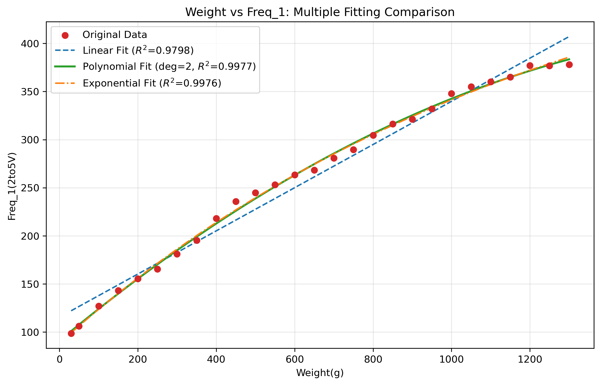

# 防止忘记

### 待办：
1. 固定好随机性种子  √
2. 加入器件层的base_ops, 使用指数函数拟合的结果重新训练一遍，然后输出需要用来绘图的数据（损失图和准确率图、混淆矩阵）  √

- 指数拟合公式: y = -463.5902 * exp(-0.0008 * x) + 551.9639 （**此时x为重量**）
- 将图片像素值映射为对应的重量压力
- 指数拟合公式: y = -463.5902 * exp(-0.0008 * **4**x) + 551.9639 （**此时x为指纹图片的像素值**）
- 
3. 加入器件测量出的噪声（如何计算噪声？如何在数据中加入噪声？），从而更好的仿真器件     √

4. 重新训练模型，输出需要用来绘图的数据（损失图和准确率图、混淆矩阵）       √

5. 加入器件与器件之间的噪声